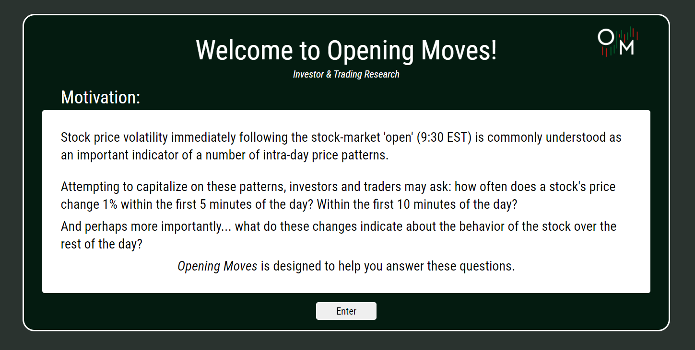
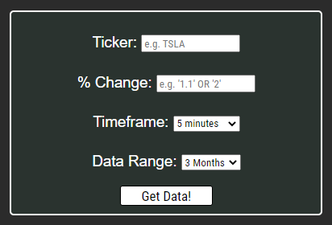
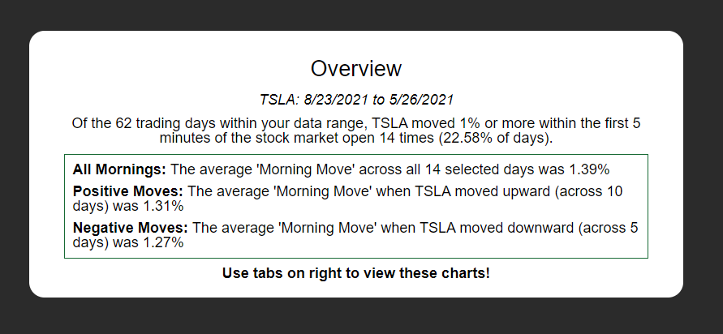
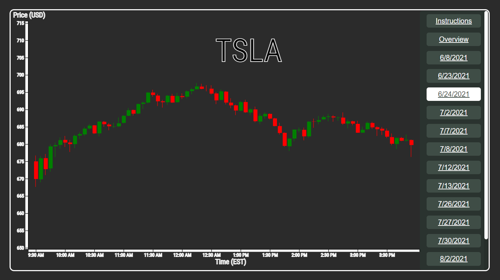

# Opening Moves

## Live Link:
[Opening Moves Live](https://openingmoves.herokuapp.com/)

## Summary:
Opening Moves is stock data visualization tool for finding trends and patterns across morning stock volatility. Users can specify input parameters and the application will render a set of matching charts. Please open the app for more detailed instructions or read on to learn more about Opening Moves!

## Table of contents:

 1. [Features](#features)
    - [Intoduction Modal](#introduction-modal)
    - [Custom Data Filters](#data-entry)
    - [Data Summary](data-summary)
    - [Charts](#charts)
    - [Loading Modal](#loading-modal)
 2. [Tech Stack](#tech-stack])
    - [Backend](#backend)
    - [Frontend](#frontend)
 4. [Upcoming Features](#upcoming-features) (coming soon!)

## Features:

### Introduction Modal

Upon entering, users are greeted with a motivation for the application as well as a basic introduction to the application's work flow.



### Data Entry

Users can specify four parameters to make a request to generate charts:
1. Ticker (e.g. TSLA for Tesla)
2. % Change: The application will find all of the days that Tesla moved said percentage within a given timeframe (see point 3)
3. Timeframe: Users specify the time frame (beginning at 9:00 AM EST) they are interested in observing the aforementioned change
4. Data Range: The period of time from which the application will extract data



```javascript
// public/javascripts/submit_form.js

 //form submit handler
 export default function submitForm(form){

   form.preventDefault()
   let ticker = form.target.ticker.value
   let percentChange = parseInt(form.target.percentChange.value)
   let dataRange = form.target.dataRange.value
   let timeFrame = parseInt(form.target.timeFrame.value) / 5
   clearErrors()
   let {valid, errors} = validateInput(ticker, percentChange)

   if (valid){
     validInput(dataRange, ticker, percentChange, timeFrame)
   } else {
     inValidInput(errors)
   }

 }

```

On successful form entry, submitForm calls validInput to begin the process of fetching and filtering data. Asynchronous requests handled using async/await:

```javascript
 // public/javascripts/submit_form.js
 
 async function validInput(dataRange, ticker, percentChange, timeFrame){
   let modalInterval = await renderLoadingModal(dataRange, ticker)
   let data = await retrieveData(ticker, dataRange)
   let filteredData = filterData(data, percentChange, timeFrame)
   let mornings = filteredData.mornings
   let volatileMornings = filteredData.volatileMornings
   let charts = generateChartData(volatileMornings, data)
   let master = {charts, ticker, percentChange, timeFrame, mornings, volatileMornings}
   createTabs(master)
   renderOverview(master)
   renderModalClose(modalInterval)
 }

```

### Data Summary

Upon receiving parsed and filtered data, the application will render a data summary report based on the parameters entered by the user:



### Charts

When the data summary is rendered, the user will also have access to a series of tabs on the right hand side to view a chart representing each day that met that specified criteria. These charts are rendered with d3.js



### Loading Modal

The data fetching, parsing, and filtering takes a (relatively) long time. For improved user experience, we render a loading modal while the charts are loading. This modal displays links to news articles related to the stock the user requested information about.

## Tech Stack:
### Front-End:
This app is built nearly entirely Vanilla Javascript on the frontend. There are no major frameworks or librarys supporting DOM manipulation. The only exception to this is d3.js is used to draw the shapes for the graphs.

### Back End:
This app has a very light-weight express backend which is used simply for the purposes of making api requests and filtering responses.
